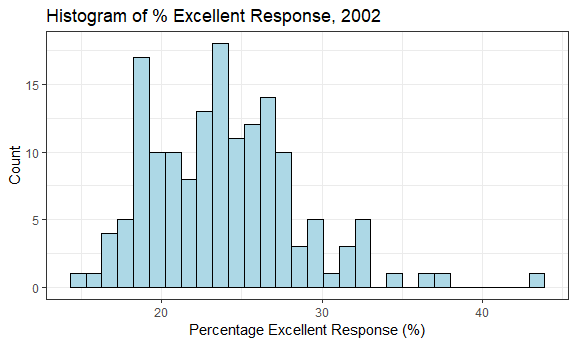
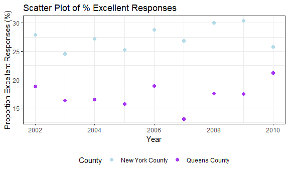

P8105 Homework 2
================
Quinton Neville
Due October 4th, 2018

This problem focuses on NYC Transit data; in particular, this CSV file contains information related to each entrance and exit for each subway station in NYC.

Read and clean the data; retain line, station, name, station latitude / longitude, routes served, entry, vending, entrance type, and ADA compliance. Convert the entry variable from character (YES vs NO) to a logical variable (the ifelse or recode function may be useful).

Write a short paragraph about this dataset – explain briefly what variables the dataset contains, describe your data cleaning steps so far, and give the dimension (rows x columns) of the resulting dataset. Are these data tidy?

Answer the following questions using these data:

How many distinct stations are there? Note that stations are identified both by name and by line (e.g. 125th St A/B/C/D; 125st 1; 125st 4/5); the distinct function may be useful here.

How many stations are ADA compliant? What proportion of station entrances / exits without vending allow entrance? Reformat data so that route number and route name are distinct variables. How many distinct stations serve the A train? Of the stations that serve the A train, how many are ADA compliant?

Problem 1
=========

``` r
#User Function to collapse route1:11 but omit NA's, returns vector of strings, for tidy data
collapse.route <- function(x){
  paste0(na.omit(x), collapse = "/")
}

#Read in & Clean Full Entry/Exit Data
nyc.transit.df <- read_csv(file = "./data/NYC_Transit_Subway_Entrance_And_Exit_Data.csv",
                     col_types = cols(
                          Route8 = col_character(),
                          Route9 = col_character(),                               #Keeping route variables consistent as chars
                          Route10 = col_character(),
                          Route11 = col_character()
                       )) %>%
                     janitor::clean_names() %>%                                     #Standardizing var names
                     select(line:route11, entry, vending, entrance_type, ada) %>%   #Selecting only necessary vars
                     mutate(entry = ifelse(entry == "YES", TRUE, FALSE),            #Casting entry as logical
                          route1 = route1 %>% toupper(),                          #Fixing incorrect lowercase e for E, route1 obs 1628
                          route5 = replace(route5, 109, NA)) %>%                  #Fixing incorrect 7 service, 6thAv-Rockefellr obs 109
                     mutate(route = apply(select(., c(route1:route11)), 1, collapse.route)) %>%  #Apply collapse, create new string var
                     select(line, station_name, route, everything(), -c(route1:route11))         #Reorder and remove old route vars
  #NOTE
#OBS 109 in original data has an extra train serviced at one of the entrances 
#(6thAV & 47-50th Sts Rockefeller Center, extra 7 train)
#OBS 1628 in original data has a miss-coded e instead of E at one entrance 
#(Queens & Forest Hills, route1 = e)

#Dimensions
dim.nyc.transit <- dim(nyc.transit.df)   #Vector of [1] Rows, [2] Columns
```

#### Data Overview and Cleaning

After initial data import and cleaning, the resulting `nyc.transit.df` data frame contains 1868 observations describing entries and exits for the N.Y.C. subway, in 9 variables. Considering these variables, `line` describes the vertical street station location, `station_name` the horizontal, `station_latitude` and `station_longitude` contain the respective cartographical coordinates of the observation's station, `route` describes a character string of specific trains serviced for each observation's station, `entry` describes a logical whether the observation is an entry or an "exit only", `vending` describes whether or not there are vending services available at each observation, `entrance_type` describes the type of entry/exit for each observation (stair, elevator, etc.), and `ada` describes whether or not the observation is compliant with the Americans with Disabilities Act requirements. Thus far, the cleaning steps have consisted of maintaining uniformity in character data type for `route1:11` when reading in the data, standardizing variable names with the `janitor` package, selecting only the variables of interest described above, transforming the `entry` variable to logical, and fixing incorrect data points. Here, the incorrectly recorded data points consisted of a lower case 'e' for the `route5` variable at Queens & Forest Hills station (observation 1628) and an incorrectly recorded service of the 7 train at 6th Ave./Rockefeller station (observation 109). Overall, we can describe this data as tidy because after collapsing the `route1:11` variables to one character string variable `route`, every row is an observation, every column a distinct variable, and every value has a cell.

``` r
#Count Distinct Stations by Line, Name, and Route
distinct.stations <- nyc.transit.df %>% distinct(., line, station_name, route) %>% nrow()

#Count distinct stations ADA compiance
distinct.ada.comp <- nyc.transit.df %>%
                     distinct(., line, station_name, route, ada) %>%
                     select(ada) %>% 
                     apply(., 2, sum, na.rm = TRUE)
distinct.ada.prop <- nyc.transit.df %>%
                     distinct(., line, station_name, route, ada) %>%
                     select(ada) %>% 
                     apply(., 2, mean, na.rm = TRUE)

#Proportion of entries/exits with no vending that allow entrance
no.vend.entry <- nyc.transit.df %>%
                     filter(vending == "NO") %>%
                     select(entry) %>%
                     apply(., 2, mean)

#Pulling those which service the A train and counting how many are ADA compliant
atrain.ada.comp <- nyc.transit.df %>%
                     mutate(service_a = grepl("A", route)) %>%
                     filter(service_a == TRUE) %>%
                     select(ada) %>%
                     apply(., 2, sum)
```

#### Solutions

Problem2 This problem uses the Mr. Trash Wheel dataset, available as an Excel file on the course website. Please use the HealthyHarborWaterWheelTotals2017-9-26.xlsx version.

Read and clean the Mr. Trash Wheel sheet:

specify the sheet in the Excel file and to omit columns containing notes (using the range argument and cell\_cols() function) use reasonable variable names omit rows that do not include dumpster-specific data rounds the number of sports balls to the nearest integer and converts the result to an integer variable (using as.integer) Read and clean precipitation data for 2016 and 2017. For each, omit rows without precipitation data and add a variable year. Next, combine datasets and convert month to a character variable (the variable month.name is built into R and should be useful).

Write a paragraph about these data; you are encouraged to use inline R. Be sure to note the number of observations in both resulting datasets, and give examples of key variables. For available data, what was the total precipitation in 2017? What was the median number of sports balls in a dumpster in 2016?

Problem 2
=========

``` r
###Mr. Trashwheel###
#Read and Clean Mr. Trash Wheel Data
trash.wheel.df <- read_xlsx("./data/HealthyHarborWaterWheelTotals2017-9-26.xlsx",
                            sheet = "Mr. Trash Wheel", range = cell_cols("A:N")) %>%  #Select only variable columns
                  janitor::clean_names() %>%                                          #Standardize variable names
                  mutate(total = grepl("Total", month),                               #Create logical for "Total", for later filtering
                         sports_balls = as.integer(sports_balls),                     #Round sports_balls to nearet integer
                         year = ifelse(is.na(year), "2017", year)) %>%                #Impute missing year to match date variable
                  filter(total == FALSE) %>%                                          #Omit all rows with non-dumpster spec. data
                  select(-total) %>%                                                  #Remove logical total variable
                  na.omit()                                                           #Omit the remaining NA rows

#Key Stats

#Dimension
dim.trash.wheel <- dim(trash.wheel.df) #c(Rows, Cols)

#Create Tibble of Summary stats to access easily inline
total.trash.df <- trash.wheel.df %>% 
              select(weight_tons:homes_powered) %>%           #Taking all the cont. variables, calculating sum/totals, store as tibble
              apply(., 2, sum) %>% 
              t() %>%
              as.tibble()
summary.trash.df <- trash.wheel.df %>% 
              select(weight_tons:homes_powered) %>%           #Taking all the cont. variables, calc. summary stats, store as tibble
              apply(., 2, summary) %>%                        #Row bind with total
              as.tibble() %>%                                 #Add 'statistic' variable to access easiliy by filter inline
              bind_rows(., total.trash.df) %>%
              mutate(statistic =  c("Min", "1Q", "Median", "Mean", "3Q", "Max", "Sum")) %>%
              select(statistic, everything())

#Calculate Median Sports Balls in 2016
median.sports.balls <- trash.wheel.df %>%
                       filter(year == "2016") %>%
                       select(sports_balls) %>%
                       apply(., 2, median)

###2016-2017 Precipitation###
#Read 2016-2017 Precipitation Data
precip.16.df <- read_xlsx("./data/HealthyHarborWaterWheelTotals2017-9-26.xlsx",
                            sheet = "2016 Precipitation", range = "A2:B14")

precip.17.df <- read_xlsx("./data/HealthyHarborWaterWheelTotals2017-9-26.xlsx",
                            sheet = "2017 Precipitation", range = "A2:B14")

#Clean 2016-2017 Precipitation Data
precip.years <- c("2016", "2017")  #Years of Precipitation observation

precip.16.17.df <- bind_rows(precip.16.df, precip.17.df) %>%                             #Row bind 16-17 data
                   janitor::clean_names() %>%                                            #Clean names
                   mutate(month = rep(month.name, times = length(precip.years)),         #Change month variable to char
                          year = rep(precip.years, each = length(month.name))) %>%       #Create variable for year of correct length
                   filter(!is.na(total))                                                 #Omit obs. w/no total reported

#Key Stats
dim.precip.16.17 <- dim(precip.16.17.df)

#Total for both years
total.precip.df <- precip.16.17.df %>% 
                   select(total) %>%              #Taking continuous variable Total
                   apply(., 2, sum) %>%           #Counting the total over both years
                   t() %>% as.tibble()

#Summary monthly rainfall for both years & total in one tibble
summary.precip.df <- precip.16.17.df %>%
                 select(total) %>%                #Taking cont. variable Total
                 apply(., 2, summary) %>%         #Summarazing it over both years
                 as.tibble() %>%                  #Binding with total for easy inline access
                 bind_rows(., total.precip.df) %>%
                 mutate(statistic =  c("Min", "1Q", "Median", "Mean", "3Q", "Max", "Sum")) %>%
                 select(statistic, everything())

#Total Precipitation in 2017
total.precip.17 <- precip.16.17.df %>%
                   filter(year == 2017) %>%
                   select(total) %>%
                   sum()
```

Problem 3
=========

This problem uses the BRFSS data. DO NOT include this dataset in your local data directory; instead, load the data from the p8105.datasets package.

For this question:

format the data to use appropriate variable names; focus on the “Overall Health” topic exclude variables for class, topic, question, sample size, and everything from lower confidence limit to GeoLocation structure data so that values for Response (“Excellent” to “Poor”) are column names / variables which indicate the proportion of subjects with each response (which are values of Data\_value in the original dataset) create a new variable showing the proportion of responses that were “Excellent” or “Very Good” Using this dataset, do or answer the following:

How many unique locations are included in the dataset? Is every state represented? What state is observed the most? In 2002, what is the median of the “Excellent” response value? Make a histogram of “Excellent” response values in the year 2002. Make a scatterplot showing the proportion of “Excellent” response values in New York County and Queens County (both in NY State) in each year from 2002 to 2010.

``` r
#Call data from p8105 library
data("brfss_smart2010")

#Clean and Manipulate BRFSS data
brfss.df <- brfss_smart2010 %>%
            janitor::clean_names() %>%
            filter(topic == "Overall Health") %>%
            select(-c(class, topic, question, sample_size, confidence_limit_low:geo_location)) %>%
            spread(key = response, value = data_value) %>% 
            janitor::clean_names() %>%
            mutate(locationdesc = substring(locationdesc, 6)) %>%
            rename(state = locationabbr, county = locationdesc) %>%
            select(year:county, excellent, very_good, good, fair, poor) %>%
            mutate(excellent_or_very_good = excellent + very_good)

#Distinct Locations/States
distinct.locations <-  brfss.df %>% distinct(., state, county) %>% nrow() #404

distinct.states <- brfss.df %>% distinct(., state) %>% nrow() 

#Which State Observed the Most
max.state.index <- brfss.df %>% count(state) %>% select(n) %>% apply(., 2, which.max)
state.max.obs <- brfss.df %>% count(state) %>% select(state) %>% slice(., max.state.index) %>% as.character()

#2002 Median 'Excellent` response
med.excel.2002 <- brfss.df %>% 
                  filter(year == 2002) %>%
                  select(excellent) %>%
                  apply(., 2, median, na.rm = T)

#Histogram of Excellent Responses in 2002
hist.excel.02 <- brfss.df %>%
                 filter(year == 2002) %>%
                 ggplot() +
                 geom_histogram(aes(x = excellent),
                                color = "black", fill = "lightblue") +
                 labs(
                   x = "Percentage Excellent Response (%)",
                   y = "Count",
                   title = "Histogram of % Excellent Response, 2002"
                 )

hist.excel.02
```

    ## `stat_bin()` using `bins = 30`. Pick better value with `binwidth`.

    ## Warning: Removed 2 rows containing non-finite values (stat_bin).



``` r
#Scatter of Prop. Excellent in NY County and Queens County, from 2002 to 2010
scatter.excel.02.10 <- brfss.df %>%
                       filter(county == "New York County" |
                              county == "Queens County") %>%
                       ggplot(aes(x = year, y = excellent, color = county)) +
                       geom_point(alpha = 0.9, size = 2) +
                       labs(
                         x = "Year",
                         y = "Proportion Excellent Responses (%)",
                         title = "Scatter Plot of % Excellent Responses"
                       ) +
                       scale_color_manual(
                         name = "County",
                         values = c("Lightblue", "Purple"))
scatter.excel.02.10
```


