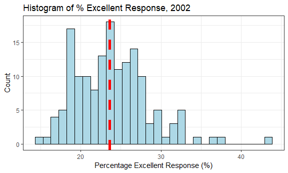
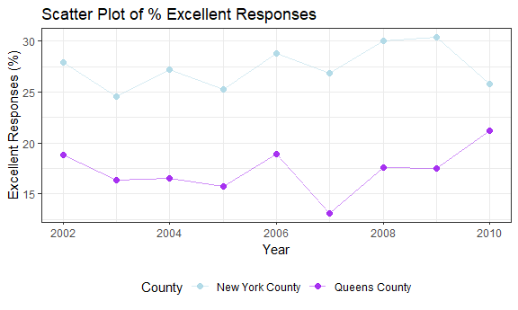

P8105 Homework 2
================
Quinton Neville
Due October 5th, 2018

Problem 1
=========

This problem focuses on NYC Transit Data, describing observations from every entry/exit on the NYC subway, in a variety of variables. After data cleaning, we will answer the following questions using these data:

-   How many distinct stations are there?
-   How many stations are ADA compliant?
-   What proportion of station entrances / exits without vending allow entrance?
-   How many distinct stations serve the A train?
-   Of the stations that serve the A train, how many are ADA compliant?

``` r
#User Function to collapse route1:11 but omit NA's, returns vector of strings, for tidy data
collapse.route <- function(x){
  paste0(na.omit(x), collapse = "/")
}

#Read in & Clean Full Entry/Exit Data
nyc.transit.df <- read_csv(file = "./data/NYC_Transit_Subway_Entrance_And_Exit_Data.csv",
                     col_types = cols(
                          Route8 = col_character(),
                          Route9 = col_character(),                               #Keeping route variables consistent as chars
                          Route10 = col_character(),
                          Route11 = col_character()
                       )) %>%
                     janitor::clean_names() %>%                                     #Standardizing var names
                     select(line:route11, entry, vending, entrance_type, ada) %>%   #Selecting only necessary vars
                     mutate(entry = ifelse(entry == "YES", TRUE, FALSE),            #Casting entry as logical
                          route1 = route1 %>% toupper(),                          #Fixing incorrect lowercase e for E, route1 obs 1628
                          route5 = replace(route5, 109, NA)) %>%                  #Fixing incorrect 7 service, 6thAv-Rockefeller obs 109
                     mutate(route = apply(select(., c(route1:route11)), 1, collapse.route)) %>%  #Apply collapse, create new string var
                     select(line, station_name, route, everything(), -c(route1:route11))         #Reorder and remove old route vars
  #NOTE
#OBS 109 in original data has an extra train serviced at one of the entrances 
#(6thAV & 47-50th Sts Rockefeller Center, extra 7 train)
#OBS 1628 in original data has a miss-coded e instead of E at one entrance 
#(Queens & Forest Hills, route1 = e)

#Dimensions
dim.nyc.transit <- dim(nyc.transit.df)   #Vector of [1] Rows, [2] Columns
```

#### Data Overview and Cleaning

After initial data import and cleaning, the resulting `nyc.transit.df` data frame contains 1868 observations describing entries and exits for the N.Y.C. subway, in 9 variables. Considering these variables, `line` describes the vertical street station location, `station_name` the horizontal, `station_latitude` and `station_longitude` contain the respective cartographical coordinates of the observation's station, `route` describes a character string of specific trains serviced for each observation's station, `entry` describes a logical whether the observation is an entry or an "exit only", `vending` describes whether or not there are vending services available at each observation, `entrance_type` describes the type of entry/exit for each observation (stair, elevator, etc.), and `ada` describes whether or not the observation is compliant with the Americans with Disabilities Act requirements. Thus far, the cleaning steps have consisted of maintaining uniformity in character data type for `route1:11` when reading in the data, standardizing variable names with the `janitor` package, selecting only the variables of interest described above, transforming the `entry` variable to logical, fixing incorrect data points, and collapsing the route variables into one character string variable. It is important to note that here, the incorrectly recorded data points consisted of a lower case 'e' for the `route5` variable at Queens & Forest Hills station (observation 1628) and an incorrectly recorded service of the 7 train at 6th Ave./Rockefeller station (observation 109). Overall, we may describe this data as 'tidy' after collapsing the `route1:11` variables to one character string variable `route`, because every row is an observation, every column a distinct variable, and every value has a cell.

``` r
#Count Distinct Stations by Line, Name, and Route
distinct.stations <- nyc.transit.df %>% distinct(., line, station_name, route) %>% nrow()

#Count distinct stations ADA compiance
distinct.ada.comp <- nyc.transit.df %>%
                     distinct(., line, station_name, route, ada) %>%
                     select(ada) %>% 
                     apply(., 2, sum, na.rm = TRUE)

#Proportion of entries/exits with no vending that allow entrance
no.vend.entry <- nyc.transit.df %>%
                     filter(vending == "NO") %>%
                     select(entry) %>%
                     apply(., 2, mean)

#Pulling those which service the A train and counting how many are ADA compliant
distinct.atrain <- nyc.transit.df %>%
                     distinct(., line, station_name, route, ada) %>%
                     mutate(service_a = grepl("A", route)) %>%
                     filter(service_a == TRUE) %>%
                     nrow()

atrain.ada.comp <- nyc.transit.df %>%
                     distinct(., line, station_name, route, ada) %>%
                     mutate(service_a = grepl("A", route)) %>%
                     filter(service_a == TRUE) %>%
                     select(ada) %>%
                     apply(., 2, sum)
```

#### Solutions

Using the cleaned `nyc.transit.df` dataframe described above, in combination with the `distinct()` function, we were able to obtain that there exist 465 distinct stations in the N.Y.C. subway system, of which 84 are compliant with the Americans with Disabilities Act requirements. Considering all station's entries and exits, of those that do not offer vending services, only 37.705% offer entrance. Finally, of the 60 distinct stations that service the A-train, 17 are also compliant with ADA requirements.

Problem 2
=========

This problem focuses on the Mr. Trash Wheel and accompanying precipitation data. After cleaning and briefly describing and summarizing these data, we will answer the following questions:

-   For available data, what was the total precipitation in 2017?
-   What was the median number of sports balls in a dumpster in 2016?

``` r
###Mr. Trashwheel###
#Read and Clean Mr. Trash Wheel Data
trash.wheel.df <- read_xlsx("./data/HealthyHarborWaterWheelTotals2018-7-28.xlsx",
                            sheet = "Mr. Trash Wheel", range = cell_cols("A:N")) %>%  #Select only variable columns
                  janitor::clean_names() %>%                                          #Standardize variable names
                  mutate(total = grepl("Total", month),                               #Create logical for "Total", for later filtering
                         sports_balls = as.integer(sports_balls)) %>%                 #Cast sports balls as integer
                  filter(total == FALSE) %>%                                          #Omit all rows with non-dumpster spec. data
                  select(-total) %>%                                                  #Remove logical total variable
                  na.omit()                                                           #Omit the remaining NA rows
#Dimension
dim.trash.wheel <- dim(trash.wheel.df) #c(Rows, Cols)

#Calculate Median Sports Balls in 2016
median.sports.balls <- trash.wheel.df %>%
                       filter(year == "2016") %>%
                       select(sports_balls) %>%
                       apply(., 2, median)
```

``` r
###2016-2017 Precipitation###
#Read 2016-2017 Precipitation Data
precip.16.df <- read_xlsx("./data/HealthyHarborWaterWheelTotals2018-7-28.xlsx",
                            sheet = "2016 Precipitation", range = "A2:B14")

precip.17.df <- read_xlsx("./data/HealthyHarborWaterWheelTotals2018-7-28.xlsx",
                            sheet = "2017 Precipitation", range = "A2:B14")

#Clean 2016-2017 Precipitation Data
precip.years <- c("2016", "2017")  #Years of Precipitation observation

precip.16.17.df <- bind_rows(precip.16.df, precip.17.df) %>%                             #Row bind 16-17 data
                   janitor::clean_names() %>%                                            #Clean names
                   mutate(month = rep(month.name, times = length(precip.years)),         #Change month variable to char
                          year = rep(precip.years, each = length(month.name))) %>%       #Create variable for year of correct length
                   filter(!is.na(total))                                                 #Omit obs. w/no total reported

#Key Stats
dim.precip.16.17 <- dim(precip.16.17.df)

#Total Precipitation in 2017
total.precip.17 <- precip.16.17.df %>%
                   filter(year == 2017) %>%
                   select(total) %>%
                   sum()
```

#### Data Overview and Cleaning

First, considering the data collected from Mr. Trash Wheel during 2014 - 2018, after cleaning the data, there exist 285 data collection observations in 14 variables. The cleaning process involved standardizing variable names, identifying and filtering out observations for "Monthly Totals", rounding sports ball values to the nearest integer, and removing excess rows without data values. After the process, the data includes variables for year, month, date, weight, volume, counts of different types of trash, and approximate amount of homes powered by the electricity generated from Mr. Trash Wheel; per each trash collection observation. Throughout the more than three years of observation, a total of 934.94 tons and 4439 cubic yards of trash were collected, with an average of 3.28 tons and 15.58 cubic yards collected per observation. Additionally, the largest average contributor per collection to Mr. Trash Wheel's consumption over this time frame, other than cigarette butts (36103.86), was polystyrene trash (2320.83), followed by plastic bottles, chip bags, and grocery bags, (1969.05, 1920.56, 1418.87), respectively. A complete table of summary statistics for the cleaned Mr. Trash Wheel data can be found below (code in the Appendix).

|        |  weight\_tons|  volume\_cubic\_yards|  plastic\_bottles|  polystyrene|  cigarette\_butts|  glass\_bottles|  grocery\_bags|  chip\_bags|  sports\_balls|  homes\_powered|
|--------|-------------:|---------------------:|-----------------:|------------:|-----------------:|---------------:|--------------:|-----------:|--------------:|---------------:|
| Min    |          0.96|                  7.00|            210.00|       320.00|           1000.00|            2.00|          50.00|      330.00|           0.00|            0.00|
| 1Q     |          2.73|                 15.00|            980.00|      1250.00|          12000.00|           12.00|         650.00|     1040.00|           5.00|           30.50|
| Median |          3.33|                 15.00|           1930.00|      2250.00|          26000.00|           26.00|        1240.00|     1840.00|           8.00|           50.67|
| Mean   |          3.28|                 15.58|           1969.05|      2320.83|          36103.86|           27.98|        1418.87|     1920.56|          12.63|           41.93|
| 3Q     |          3.83|                 17.00|           2670.00|      3150.00|          46000.00|           42.00|        2130.00|     2660.00|          18.00|           60.33|
| Max    |          5.62|                 20.00|           5960.00|      6540.00|         310000.00|          110.00|        3750.00|     5085.00|          56.00|           93.67|
| Sum    |        934.94|               4439.00|         561180.00|    661437.00|       10289600.00|         7975.00|      404377.00|   547359.00|        3599.00|        11950.67|

Next, considering the Precipitation Data collected during 2016 - 2017 in the same region as Mr. Trashwheel's garbage routes, there were 24 monthly observations, in 3 variables: total precipitation (in.) by month, month, and year. Cleaning this data involved reading in two data sets, 2016 and 2017 respectively, joining them by row, standardizing variable names, creating variables for month and year of precipitation observation, and removing observations without recorded precipitation data. With respect to the cleaned data, the total precipitation over the observation period from Jan. 2016 - Dec. 2017 was 72.88 in., with an average of 3.04 in. and median of 2.77 in. per month. A complete table of summary statistics for total precipitation, in inches, over this time frame can be found below (code in the Appendix).

|       |  Min|    1Q|  Median|  Mean|    3Q|   Max|    Sum|
|-------|----:|-----:|-------:|-----:|-----:|-----:|------:|
| total |    0|  1.47|    2.77|  3.04|  4.46|  7.09|  72.88|

#### Solutions

With respect to the two cleaned data frames concerning Mr. Trash Wheel and monthly precipitation, outlined above, we were able to obtain that there was an observed total precipitation of 32.93 in. in 2017, while the median number of sports balls collected by Mr. Trash Wheel was 26 in 2016.

Problem 3
=========

This problem focuses on the BRFSS data set, loaded from the p8105 github repository. After cleaning and briefly summarizing these data, we will answer the following questions:

-   How many unique locations are included in the dataset? Is every state represented? What state is observed the most?
-   In 2002, what is the median of the “Excellent” response value?
-   Make a histogram of “Excellent” response values in the year 2002.
-   Make a scatterplot showing the proportion of “Excellent” response values in New York County and Queens County (both in NY State) in each year from 2002 to 2010.

``` r
#Call data from p8105 library
data("brfss_smart2010")

#Clean and Manipulate BRFSS data
brfss.df <- brfss_smart2010 %>%
            janitor::clean_names() %>%                                                              #Standardize var names
            filter(topic == "Overall Health") %>%                                                   #Subset by Overall Health
            select(-c(class, topic, question, sample_size, confidence_limit_low:geo_location)) %>%  #Remove vars we dont want
            spread(key = response, value = data_value) %>%                                          #Create col. vars for % responses
            janitor::clean_names() %>%                                                              #Standardize new var names
            mutate(locationdesc = substring(locationdesc, 6) %>% toupper(),                         #Remove redundant state, std. chars 
                   locationabbr = locationabbr %>% toupper,                                         #Std. chars
                   excellent_or_v_good = excellent + very_good) %>%                                 #Create variable % excl|v.good
            rename(state = locationabbr, county = locationdesc) %>%                                 #Rename state, county
            select(year:county, excellent, very_good, good, fair, poor, excellent_or_v_good)        #Reorder data

#Dimensions Clean BRFSS
dim.brfss <- dim(brfss.df)

#Distinct Locations/States
distinct.locations <-  brfss.df %>% distinct(., state, county) %>% nrow() #Multiple county names in dif. states, so distinct() state/cty

distinct.states <- brfss.df %>% distinct(., state) %>% nrow() #If D.C. counts, 51, otherwise all 50 observed

#Which State Observed the Most
max.state.index <- brfss.df %>% count(state) %>% select(n) %>% apply(., 2, which.max)
state.max.obs <- brfss.df %>% count(state) %>% select(state) %>% slice(., max.state.index) %>% as.character()

#2002 Median 'Excellent` response
med.excel.2002 <- brfss.df %>% 
                  filter(year == 2002) %>%
                  select(excellent) %>%
                  apply(., 2, median, na.rm = T)
```

#### Data Overview and Cleaning

After inital data import and cleaning, the resulting `brfss.df` dataframe contains 2125 county level observations in 9 variables. These variables include year of observation from 2002-2010, state of observation, and response type from "Excellent" - "Poor" describing the percentage of county respondants who selected this response for their "Overall Health". The initial cleaning steps involved standardizing variable names, subseting by "Overal Health" responses, removing extraneous variables, spreading response type to column variables, standardizing new column names, removing redundant state information and renaming state and county variables, creating a new variable to describe the percentage of county respondants who selected "Excellent" or "very Good", and finally, reordering the data for readability.

#### Solutions

Considering the newly cleaned data frame `brfss.df`, we were able to obtain that of county level respondants for "Overall Health"" over 8 years of observations, 404 distinct counties by state were observed and all 50 states were represented, including the District of Columbia. Throughout this time period, the state of NJ contributed the most to these "Overall Health" data, tallying 146 total county level observations. Lastly, the median "Excellent" response percentage by county was discovered to be 23.6 in the year 2002. A histogram of the percentage of "Excellent" responses in 2002, with the median highlighted in red, is found below. Additionally, a scatter plot depicting the change in percentage excellent responses per year for New York and Queens county is also given below.

``` r
#Histogram of Excellent Responses in 2002
hist.excel.02 <- brfss.df %>%
                 filter(year == 2002) %>%
                 ggplot() +
                 geom_histogram(aes(x = excellent),
                                color = "black", fill = "lightblue") +
                 geom_vline(xintercept = med.excel.2002, size = 2, colour = "red", linetype = "dashed") +
                 labs(
                   x = "Percentage Excellent Response (%)",
                   y = "Count",
                   title = "Histogram of % Excellent Response, 2002"
                 )
hist.excel.02
```



``` r
#Scatter of Prop. Excellent in NY County and Queens County, from 2002 to 2010
scatter.excel.02.10 <- brfss.df %>%
                       filter(county == "NEW YORK COUNTY" |
                              county == "QUEENS COUNTY") %>%
                       ggplot(aes(x = year, y = excellent, color = county)) +
                       geom_point(alpha = 0.9, size = 2) +
                       geom_line(alpha = 0.5, size = 0.5) +
                       labs(
                         x = "Year",
                         y = "Excellent Responses (%)",
                         title = "Scatter Plot of % Excellent Responses"
                       ) +
                       scale_color_manual(
                         name = "County",
                         values = c("Lightblue", "Purple"),
                         labels = expression("New York County", "Queens County")
                         )
scatter.excel.02.10
```



Appendix
========

``` r
#####Creating summary tibbles for inline access/visualization####
###Mr. Trash Wheel Summary Statistics Tibble###
total.trash.df <- trash.wheel.df %>% 
              select(weight_tons:homes_powered) %>%           #Taking all the cont. variables, calculating sum/totals, store as tibble
              apply(., 2, sum) %>% 
              t() %>%
              as.tibble()
summary.trash.df <- trash.wheel.df %>% 
              select(weight_tons:homes_powered) %>%           #Taking all the cont. variables, calc. summary stats, store as tibble
              apply(., 2, summary) %>%                        #Apply summary() by column
              apply(., 2, round, 2) %>%                       #Round values to two digits for presentation
              as.tibble() %>%                                 #Transform from matrix to tibble
              bind_rows(., total.trash.df) %>%
              apply(., 2, round, 3) %>% as.tibble()

rownames(summary.trash.df) <- c("Min", "1Q", "Median", "Mean", "3Q", "Max", "Sum") #For easy inline access

###Precipitation Summary Statistics Tibble###
#Total for both years
total.precip.df <- precip.16.17.df %>% 
                   select(total) %>%              #Taking continuous variable Total
                   apply(., 2, sum) %>%           #Counting the total over both years
                   t() %>% as.tibble()

#Summary monthly rainfall for both years & total in one tibble
summary.precip.df <- precip.16.17.df %>%
                 select(total) %>%                #Taking cont. variable Total
                 apply(., 2, summary) %>%         #Summarazing it over both years
                 as.tibble() %>%                  #Binding with total for easy inline access
                 bind_rows(., total.precip.df) 

#Name rows by summary stat. for easy access inline 
rownames(summary.precip.df) <- c("Min", "1Q", "Median", "Mean", "3Q", "Max", "Sum")
```
